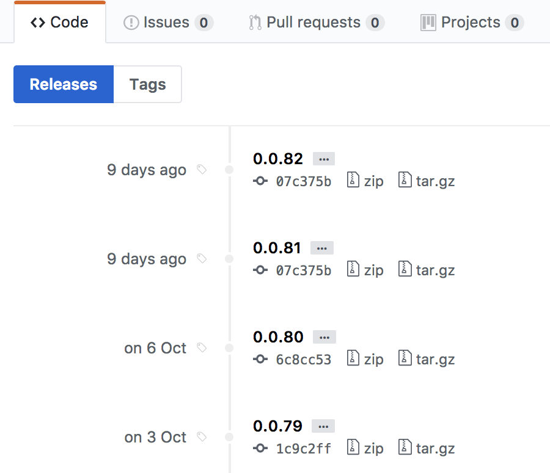
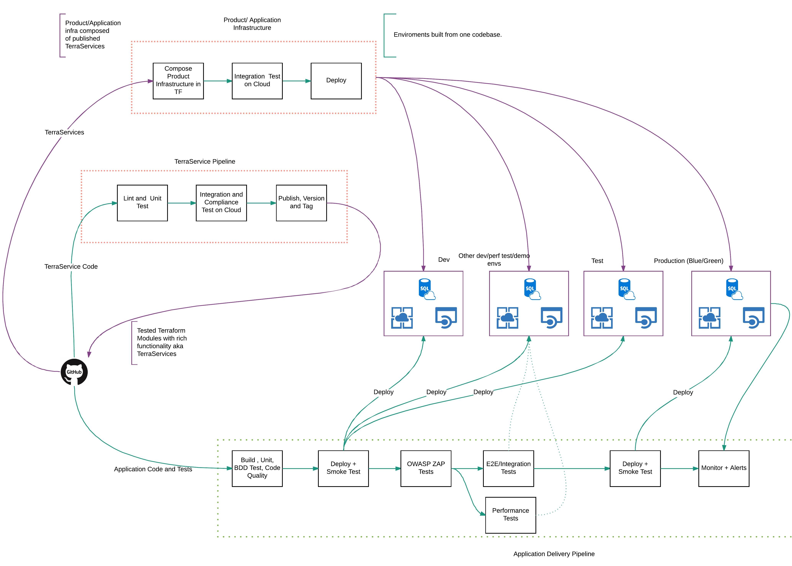
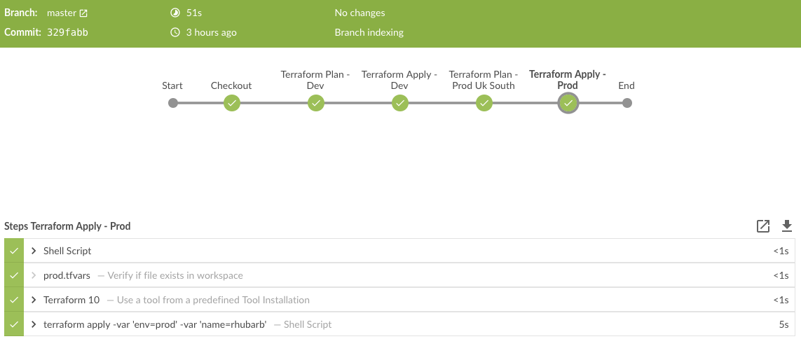

# Terraform for grownups - A model for scaling Terraform workflow in a large organisation

It’s very easy to run terraform from a laptop and go wild managing your infrastructure. But what do you do when you start working on more complex infrastructure. How do you avoid running into each other ?

This is not about scaling infrastructure, but about scaling working practices and architecture so that you can support a large landscape of teams and applications.

More importantly, how do you scale the workflow to support working with more of your team and other teams. This is a model used in a recent project for a large organisation to support ~200 developers in multiple teams.

[Nicki Watt](https://twitter.com/techiewatt) coined the term “[Terraservices](https://www.slideshare.net/opencredo/hashidays-london-2017-evolving-your-infrastructure-with-terraform-by-nicki-watt)” at HashiDays London 2017. This view of Terraform modules is key to scaling.

## Terraservices

A Terraservice is an opinionated Terraform module that provides an architectural building block. A Terraservice encapsulates how  your organisation wants to build a particular component. 

For example, this is a Terraservice to build a [Web Application Service](https://azure.microsoft.com/en-gb/services/app-service/web/) on Azure. 

```code
module "frontend" {
  source   = "git::github.com/contino/module-webapp?ref=master"
  product  = "${var.product}-frontend"
  location = "${var.location}"
  env      = "${var.env}"
  
  app_settings = {
    REDIS_HOST                   = "${module.redis-cache.host_name}"
    RECIPE_BACKEND_URL           = "${module.recipe-backend.url}"
    WEBSITE_NODE_DEFAULT_VERSION = "8.8.0"
  }
}
```

This Terraservice encapsulates how the Web Application should be configured. Scaling parameters, logging, alerting and sane defaults are set inside the Terraservice. The Terraservice exposes an interface that doesn’t require the consumer to know too much about the details of the underlying infrastructure and is opinionated towards productivity.

In this instance, the Terraservice is consumed by an application development team, to build out their product stack.

## Terraservices have their own pipelines
A Terraservice has it’s own CI/CD pipeline. The pipeline runs unit, integration and compliance tests. It can even autogenerate documentation. 

The integration and compliance tests run in a sandbox environment, and spin up their own test harnesses to exercise changes the Terraservice. 

At the end of the pipeline, when tests are green, the Terraservice is versioned and tagged. 


This ensures that a consumer picks a specific published version or stays on master to be on the bleeding edge. Keeping master stable and use [Trunk Based Development](https://trunkbaseddevelopment.com/) practices.

##  Terraservices and Terraform Projects
Terraservices are used to compose infrastructure in Terraform projects. The Terraform projects each have their own pipelines. 
Terraform projects use remote state to share outputs, which are consumed by other Terraform projects. This is how it all flows together.




It’s the Terraform project pipelines that build actual infrastructure. They are decoupled from the application pipelines intentionally. The pipelines create empty environments that code can be deployed to. The master branch of a Terraform project reflects the current state of infrastructure. Each environment is built the same way. Environment specific variables can be tuned to change the behaviour, but once a change is committed to master, the pipelines apply the change to all environments as long as each stage in the pipeline stays green.


There can be more automated quality gates between pipeline stages but it’s important to ensure that no infrastructure used, is built manually. Building infrastructure via delivery pipelines early on, helps drive out issues that can hit your workflow later when more people work on it. An automated process is easier to improve, than a manual one.

## Pick the right architecture
This is a delicate balance to achieve and there is no right answer. Pay attention to the automation pain points. Some infrastructure components can take a long time to provision. Split these out into their own Terraform projects so that they can be pre-provisioned, to be consumed by other downstream Terraform projects.

Keep core network and components that deal with core security away from Terraform projects that deal with application stacks. The application infrastructure should have dependencies on core components and use what has already been created but not be able to change it. 

The infrastructure should be architected in a way that an application infrastructure can be destroyed without affecting other applications or core components. 

##Pick the right team structure
A crucial part of this is how the teams are organised and use Terraservices. A platform engineering team is needed to shepherd    Terraservices and continuously drive the right ways of working. This team has to look across the organisational landscape and define how the  Terraservices are built, ensure they help teams build their applications quickly and provide enough so that teams don’t have the need to build their own infrastructure differently.

The Terraform projects which drive the application stacks are under the control of the application teams. This means that they can iterate rapidly, and use components from an approved library of Terraservices to compose their infrastructure.

The Terraservices themselves, are maintained by a platform engineering team, but can accept pull requests from anyone in the organisation, using an internal OSS model. The role of this platform engineering team is to provide enough tooling for teams to self-serve.

## Will it work for us?
This model provides a way for large organisations to allow individual product teams to build their own infrastructure, whilst providing control over how they are built. 

What this doesn’t cover is, what if a team decides to use Terraform primitives instead of the available Terraservices? 

This can be solved via peer reviews and the use of a [Janitor monkey](https://medium.com/netflix-techblog/janitor-monkey-keeping-the-cloud-tidy-and-clean-d517ad74d648), which ensures that only components built the right way are allowed to exist. 

In addition, Terraservices provide a happy path for teams to get up and running quickly, and are less likely to build their own. 

## Further reading
1. [Evolving Your Infrastructure with Terraform ](https://www.youtube.com/watch?v=wgzgVm7Sqlk)
2. [How to use Terraform as a team](https://blog.gruntwork.io/how-to-use-terraform-as-a-team-251bc1104973)
3. [Terraform Recommended Practices](https://www.terraform.io/docs/enterprise-beta/guides/recommended-practices/index.html) 


